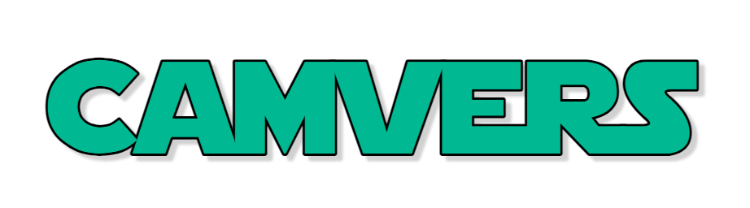
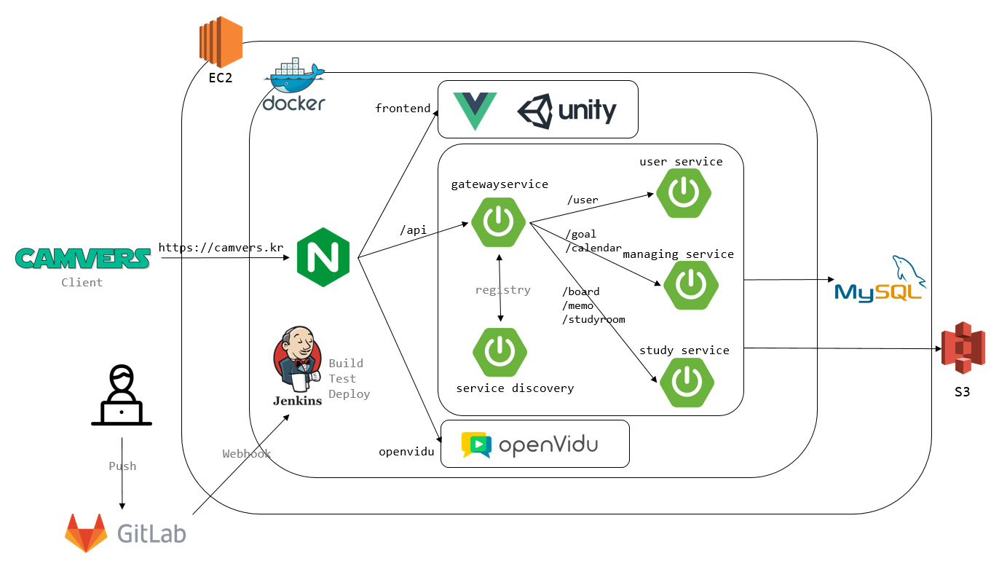
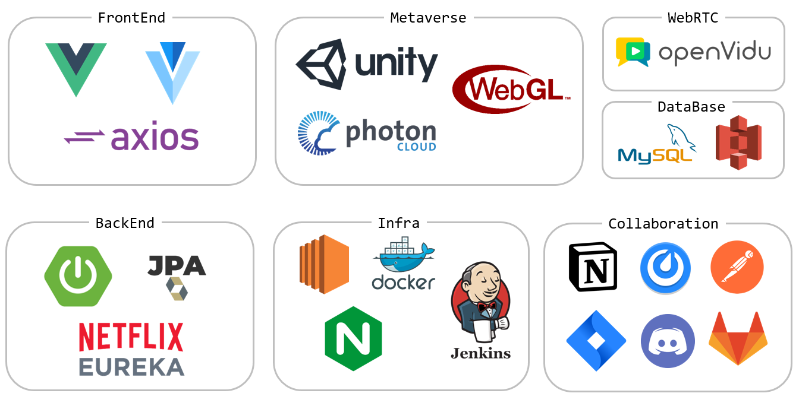

# 📖 캠버스 (Camvers)

 

 

## ✏ 프로젝트 개요

#### 집에서도 공부 의지를 불태울 수 있는 메타버스 스터디룸

- **진행 기간:** 2021.10.11 ~ 2021.11.19

- **서비스 주요 기능**

  - 다른 사람과 공부 모습을 함께 공유하는 캠스터디
  - 원하는 인원, 성격에 맞는 스터디룸 생성
  - 서로 소통 가능한 협업룸
  - 공부 기록, 목표, 일정 저장 및 확인
  - 본인의 아바타를 나타낼 수 있는 캐릭터 커스텀

 

- **서비스 목표**

  - 캠스터디를 통한 공부 의지 도모
  - 메타버스 공간을 활용한 흥미 요소 제공 및 사용자 경험과 몰입을 향상시킴

    

 

## 👩‍💻 팀원 소개

|   
이희준
  |  
김나영
  |  
박선아
 |
| :-----------------------------: | :-------------------------------: | :------------------------: |
|      |  |  |
| `Project Manager`   `Unity`                         |  `Backend`  `Frontend`                          |  `Backend` `Frontend`   |

 

## 🎞 프로젝트 UCC

 

## 🧩  서비스 아키텍처

 

## 💻 기술 스택

 

## 🎮 실행 가이드

### [🔧 포팅 매뉴얼](./exec/PortingManual.md)

### [📃 시연 시나리오](./exec/캠버스-시연-시나리오.pdf)

### [💡 캠버스 바로가기](https://camvers.kr)

